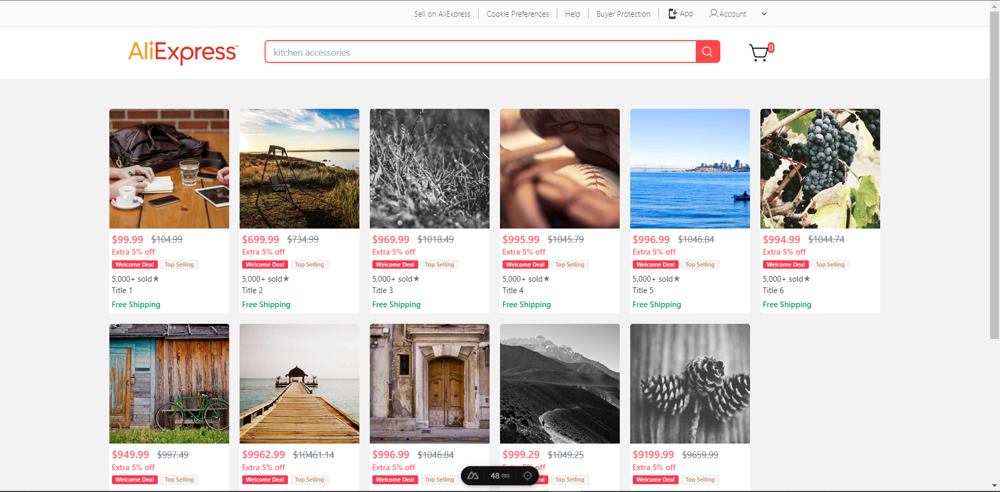

#  AliExpress Clone using Vue

This project is a clone of the popular e-commerce platform, AliExpress. It's built using [Nuxt.js](https://nuxt.com/), a powerful [Vue.js](https://vuejs.org/) framework that allows for server-side rendering and generating static websites.

##  App Preview (Dev Mode)



The image above provides a preview of the application in development mode.

## Prerequisites

Before you begin, ensure you have met the following requirements:

- You have installed [Node.js](https://nodejs.org/en) and npm/yarn/pnpm on your local machine.
- You have a basic understanding of [JavaScript](https://developer.mozilla.org/en-US/docs/Web/javascript) and [Vue.js](https://vuejs.org/).

## Setup

First, clone the repository to your local machine:

```bash
git clone https://github.com/ronhedwigzape/vue-aliexpress-clone
```

Navigate to the project directory:

```bash
cd vue-aliexpress-clone
```

Install the necessary dependencies:

```bash
# If you're using npm:
npm install

# If you're using pnpm:
pnpm install

# If you're using yarn:
yarn install
```

## Development Server

To start the development server on `http://localhost:3000`, run:

```bash
# npm
npm run dev

# pnpm
pnpm run dev

# yarn
yarn dev
```

Your application should now be running on `http://localhost:3000`.

## Production

To build the application for production, run:

```bash
# npm
npm run build

# pnpm
pnpm run build

# yarn
yarn build
```

This will create a `dist` directory with everything you need to deploy your application.

To locally preview the production build, run:

```bash
# npm
npm run preview

# pnpm
pnpm run preview

# yarn
yarn preview
```

Your built application should now be running on `http://localhost:5000`.

For more information on deploying your application, check out the [Nuxt.js deployment documentation](https://nuxt.com/docs/getting-started/deployment).